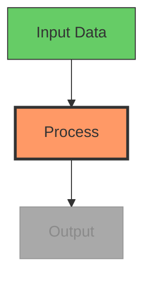

# OpenMontage 中的图表生成用法

> 资料来源：Mermaid.js 官方文档、位于 `.agents/skills/beautiful-mermaid/` 的现有 Layer 3 技能、
> Mermaid-Sonar 复杂度分析研究、Mermaid GitHub issue #651（缩放）、#3029（动画）

## 速查卡

```
最大节点数（1080p）：  15-20 个节点，20-25 条边
最大节点数（4K）：     25-35 个节点，35-45 条边
最大节点数（竖屏）：   10-12 个节点，12-15 条边
最小字号：             1080p 下 16px，4K 下 14px
渲染宽度：             至少 1200px
渲染视口：             3840x2160（4K），用于高分辨率 PNG 导出
主题（深色背景）：     tokyo-night 或 dracula
主题（浅色背景）：     github-light 或 catppuccin-latte
```

## 图表类型选择

| 类型 | 适合视频的程度 | 适用于 |
|------|------------------|----------|
| **流程图（TD）** | 优秀 | 流程、决策树、算法 |
| **时序图** | 良好 | API 调用、用户交互、消息流 |
| **状态图** | 良好 | 状态机、生命周期、工作流状态 |
| **类图** | 一般 | 架构（限制在 3-5 个类以内） |
| **ER 图** | 不适合视频 | 太密集 —— 只保留关键实体做简化 |
| **甘特图** | 一般 | 时间线、项目阶段 |
| **思维导图** | 良好 | 概念总览、话题拆解 |

**默认：** 除非内容明确要求别的类型，否则使用自上而下（`TD`）的流程图。它们读起来自然，也便于逐步搭建。

## 视频场景下的复杂度上限

视频是转瞬即逝的 —— 观众无法缩放或滚动。相比静态文档，复杂度要砍掉一半。

| 目标分辨率 | 最大节点数 | 最大边数 | 最小字号（CSS） |
|------------------|-----------|-----------|---------------------|
| 1920x1080（HD） | 15-20 | 20-25 | 16px |
| 3840x2160（4K） | 25-35 | 35-45 | 14px |
| 1080x1920（竖屏） | 10-12 | 12-15 | 18px |

**若你的图表超出这些上限：** 把它拆成多帧，每帧展示一个子集。这同时也自然形成了视频里的"逐步搭建"动画。

## 视频用的配色主题

| 使用场景 | 主题 | 理由 |
|----------|-------|-----|
| 深色视频背景 | `tokyo-night` 或 `dracula` | 高对比，易读 |
| 浅色视频背景 | `github-light` 或 `catppuccin-latte` | 柔和、专业 |
| 代码/开发者内容 | `one-dark` | 开发者受众熟悉 |
| 最大对比度 | `zinc-dark` | 中性，无色彩偏向 |
| 企业/演示 | `nord-light` | 沉静、专业 |

**匹配 playbook：** 图表主题应与风格剧本的配色相协调。

## 视频中的渐进式搭建

Mermaid 本身不支持动画。用渐进式渲染来制造"逐步搭建"的效果：

### 做法：多阶段渲染

1. 分阶段渲染图表 —— 先 2 个节点，再 4 个，最后完整图
2. 每个阶段是一次独立的 Mermaid 渲染 → SVG → PNG
3. 在 FFmpeg 里对各阶段做交叉淡化或硬切
4. 观众得以逐步跟上逻辑

### 高亮当前步骤

用 `classDef` 高亮当前活跃节点、淡化已完成节点：



每一步生成一张 PNG、各自配不同的 `classDef` 分配，然后在 compose 阶段把它们排成序列。

## 面向视频可读性的样式

### 节点尺寸
- 1080p 下最小节点宽度：150px
- 节点内边距：15-20px
- 每个节点文字控制在 3-5 个词 —— 必要时用缩写

### 边标签
- 最多 1-2 个词
- 只有当关系无法从上下文看出时才用边标签
- 优先给节点加标签，而不是给边加标签

### 布局方向
- **自上而下（TD）：** 最适合流程、层级、流向
- **从左到右（LR）：** 最适合时间线、序列、管线
- 避免自下而上（BT）—— 对多数观众而言反直觉

## 应用到 OpenMontage

使用 `diagram_gen` 工具时：

1. **检查复杂度** —— 1080p 下最多 15-20 个节点。更大的图表拆成多帧
2. **选择主题**以匹配视频的风格剧本与背景
3. **使用渐进式搭建** —— 分阶段渲染并交叉淡化，在视频中形成"搭建"效果
4. **用 classDef 高亮** —— 当前步骤用橙/红，已完成用绿，未开始用灰
5. **文字保持精简** —— 每节点 3-5 个词，每条边标签 1-2 个词
6. **默认使用流程图 TD**，除非内容明确要求别的图表类型
7. **以 4K 视口渲染**（3840x2160），即便输出是 1080p —— 这样缩放后文字依然锐利
8. **测试可读性** —— 在合成之前，按视频实际画面尺寸查看渲染出的 PNG
